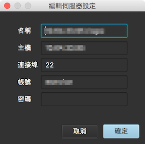
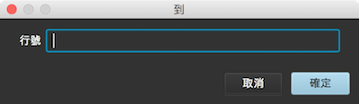

# Remote Tail - via SSH

檢視遠端 linux 上的工具程式

> 系統需求

* Java 8 update 60+

> Linux 環境需求

* 支援 SSH
* 支援 grep 指令
* 支援 cut 指令
* 支援 wc 指令
* 支援 sed 指令

> 主要畫面

> 新增伺服器

> 新增 Log

> 偏好設定

* 字型設定
* 文字大小設定
* 檔案讀取編碼
* 外觀設定

> 設定 High light

* 支援 regular expression

> High light 顯示

> 內容搜尋

* 快速鍵
    * windows : ctrl + f
    * mac : command(⌘) + f

> 內容搜尋

* 支援 regular expression

> 快速移動至指定行

* 快速鍵
    * windwos : ctrl + g
    * mac : command(⌘) + g

